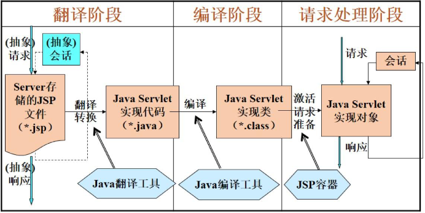

## 6.1 数据库连接技术

### 一、数据库编程简介

1. 客户端应用编程
2. 数据库服务器端编程
3. 编程结合ODBC/JDBC


### 二、ODBC技术

- Microsoft推出了 #开放式数据库互连 （Open Database Connectivity，ODBC）技术。
- ODBC定义了一套基于SQL的、公共的、与数据库无关的API（应用程序设计接口）。
- 使得应用程序与数据库管理系统（DBMS）之间在逻辑上具有独立性，即应用程序具有数据库无关性。

### 三、ODBC的层次结构


1. #ODBC应用程序接口 （ #ODBC_API ）是一种使用ODBC技术实现应用程序与数据库互连的标准接口。Windows操作系统的ODBC应用程序接口文件为 `odbc32.dll`。
2. #ODBC驱动程序管理器 用于管理系统中的各种数据库的ODBC驱动程序。
3. #驱动程序 是一个用于支持ODBC函数调用的模块，通常是一个动态链接库DLL。不同RDBMS的驱动程序是不同的。每种数据库都要向ODBC驱动程序管理器注册它子集的驱动程序。建立于数据源的连接，向数据源提交请求，在应用程序需求时，转换数据格式，返回结构给应用程序。将运行错误格式化为标准代码返回，需要时可声明和处理游标。
4. #数据源 是驱动程序与数据库系统连接的桥梁。在连接数据库时，用数据源名来代表用户名、服务器名、连接的数据库名等；可以将数据源名看成是与一个具体数据库建立的连接。

### 四、应用程序使用ODBC访问数据库的步骤

1. 首先必须用ODBC管理器注册一个数据源；
2. 管理器根据数据源提供的数据库位置、数据库类型及ODBC驱动程序等信息，建立起ODBC与具体数据库的联系；
3. 应用程序只需将数据源名提供给ODBC，即可建立与相应数据库的连接；
4. 应用程序通过驱动程序管理器与数据库交换信息；
5. 驱动程序管理器负责将应用程序对ODBC API调用传递给正确的驱动程序；
6. 驱动程序在执行完相应的SQL操作后，将结果通过驱动程序管理器返回给应用程序。

### 五、使用ODBC管理器配置数据源

1. 在数据库官网下载对应的驱动程序；
2. 例如`psqlodbc_x64.msi`驱动程序支持PostgreSQL 64位数据库；
3. 执行`psqlodbc_x64.msi`，安装PostgreSQL 数据库驱动程序；
4. 打开ODBC管理器并配置数据源。

### 六、JDBC

#JDBC （Java Database Connectivity，Java数据库连接）是一种用于执行SQL语句的Java API。它由一组用Java编程语言编写的类和接口组成。这个API由`java.sql.*`包中的一些类和接口组成，它位数据库开发人员提供了一个标准的API，使它们能够用纯Java API来编写数据库应用程序。

### 七、JDBC工作原理


### 八、JDBC程序访问数据库步骤

1. 应用程序开始
2. 导入java.sql包
3. 加载并注册驱动程序
	- 加载JDBC驱动是通过调用方法 `Class.forName("驱动名字")`
	- PostgreSQL数据库驱动程序加载语句 `Class.forName("org.postgresql.Driver")`
4. 创建Connection对象
	- 与数据库建立连接的方法是调用 `DriverManager.getConnection(String url)`方法
	- 与PostgreSQL数据库建立连接的语句
		```java
		String URL = "jdbc:postgresql://localhost:5432/testdb";
		String userName = "myuser";
		String passWord = "sa";
		connection conn = DriverManager.getConnection(URL,userName,passWord);
		```
5. 创建Statement对象
	- 用Connection对象的方法`createStatement()`创建Statement：`Statement stmt = conn.createStatement();`
6. 执行SQL语句
	- 创建了Statement对象，就可以向Statement对象发送SQL语句。主要掌握两种执行SQL语句的方法：`execute()`和`executeUpdate()`
	- `execute()`：返回语句执行后的查询结果集，所以通常用于select语句
	- `executeUpdate()`：返回值是一个整数，指示受影响的行数（可以用于update、insert、delete语句）。
		```java
		Statement stmt = conn.createStatement();
		String sql = "insert into public.student(sid,sname,gender,birthday,major,phone)" + "values('2017001','张三','男','1998-10-10','软件工程','13602810001')";
		stmt.executeUpdate(sql);
		```
7. 使用ResultSet对象返回结果
	- ResultSet对象被称为 #结果集 ，它代表符合SQL语句条件的所有行，并且它通过一套getXXX方法提供了对这些行中数据的访问。
	- ResultSet中包含了多行结果数据，每行有多个字段，并且有一个记录指针，指针所指的数据行叫做 #当前数据行 。应用程序1次只能访问当前数据行。如果想要移动指针，需要使用ResultSet的`next()`方法。如果需要访问ResultSet中的所有记录，就应该使用while循环。
		```java
		rs = stmt.executeQuery(sql);
		while(rs.next()){ // 依次取出数据
			String name = rs.getString("name"); // 取出name列的内容
			int age = rs.getInt("age"); // 取出age列的内容
		}
		```
	- 作为一种好的编程风格，在不需要ResultSet对象、Statement对象和Connection对象时，应该显式地关闭它们。
8. 关闭ResultSet对象：`rs.close();`
9. 关闭Statement对象：`stmt.close();`
10. 关闭Connection对象：`conn.close();`
11. 结束

### 九、在Eclipse下使用JDBC连接数据库

- 在PostgreSQL官网下载JDBC驱动程序包`postgresql-42.2.2.jar`；
- 在Eclipse中创建工程PostgreSQL；
- 在PostgreSQL工程中创建jdbclib目录，并将`postgresql-42.2.2.jar`拷贝到该目录；
- 并在工程中配置外部jar包路径。

### 十、Java使用JDBC连接数据库

```java
package testConnDB;

import java.sql.Connection;
import java.sql.DriverManager;
import java.sql.ResultSet;
import java.sql.SQLException;
import java.sql.Statement;

public class JDBCDemoDB {
    public static void main(String args[]) {
        Connection conn = null;
        Statement stmt = null;
        String URL = "jdbc:postgresql://localhost:5432/testDB";
        String userName = "myuser";
        String passWord = "sa";
        try {
            Class.forName("org.postgresql.Driver");
            conn = DriverManager.getConnection(URL, userName, passWord);
            System.out.println("Opened database successfully");
            String sql = "select * from student"; // 查询数据的SQL语句
            stmt = conn.createStatement(); // 创建执行SQL语句的Statement对象
            ResultSet rs = stmt.executeQuery(sql); // 执行查询语句，返回结果集
            System.out.println("最后查询结果为：");
            while (rs.next()) { // 判断是否还有下一个数据
                System.out.println(rs.getString("sid") + " " + rs.getString("sname") + " " + rs.getString("sex") + " "
                        + rs.getString("classid")); // 输出查到的记录的各个字段的值
            }
            stmt.close();
            conn.close();
        } catch (ClassNotFoundException e) {
            e.printStackTrace();
        } catch (SQLException e) {
            e.printStackTrace();
        }
    }
}

```

## 6.2 JavaWeb数据库编程

### 一、Web数据库系统工作原理


### 二、Java Web常用开发技术

HTML、CSS、JavaScript、Servlet技术、JSP技术、JavaBean技术、JDBC技术、XML、AJAX技术、Spring Struts技术等。

### 三、Java Web服务器

1. Tomcat（Apache）：当前应用最广的JavaWeb服务器
2. JBoss（Redhat）：支持JavaEE，应用比较广
3. Weblogic（Oracle）：Oracle开发JavaWeb服务器，支持JavaEE，适合大型项目
4. Websphere（IBM）：IBM开发JavaWeb服务器，支持JavaEE，适合大型项目

### 四、JavaWeb IDE集成开发工具

1. #Eclipse 是Java的集成开发环境（IDE），是一个开源的、基于Java的可扩展开发平台。Eclipse也可以作为其它开发语言的集成开发环境，如C、C++、PHP和Ruby等。
2. #MyEclipse 企业级工作平台（MyEclipse Enterprise Workbench，MyEclipse）是对EclipseIDE的扩展，利用它可以在数据库和JavaEE的开发、发布以及应用程序服务器的整合方面极大地提高工作效率。它是功能丰富的JavaEE集成开发环境，包括了完备的编码、调试、测试和发布功能，完整支持HTML、Struts、JSP、CSS、JavaScript、Spring、SQL、Hibernate。
3. #IntelliJ_IDEA 是Java语言开发的集成环境，是公认为业界最好的Java开发工具之一。

### 五、Servlet技术

Servlet 是用Java语言编写的服务器端小程序，驻留在web服务器中，并在其中运行，它扩展了web服务器的动态处理功能。

1. Servlet执行原理
   1. 客户机将HTTP请求发送给Web服务器
   2. Web服务器将该请求转发给Servlet
   3. Servlet处理该请求
   4. Servlet将响应发送给Web服务器
   5. Web服务器将响应转发给客户机
   
2. Web容器
   1. Web容器提供了运行servlet所需的环境；
   2. 它负责实例化、初始化、调用服务方法并从服务中移除servlet，管理servlet的生命周期；
   3. 实现servlet API；
   4. 它充当web服务器和servlet之间的桥梁；
   5. 将请求从web服务器转发到servlet；
   6. 将响应从servlet转发到web服务器。
3. servlet基本工作流程
   1. 客户机将请求发送到服务器；
   2. servlet程序是由web服务器调用，web服务器收到客户端的servlet访问请求后，解析客户端的请求；
   3. 服务器上的web容器实例化servlet；
   4. 调用servlet实例对象的`init()`方法；
   5. 调用servlet的`service()`方法并将请求和响应对象作为参数传递进去；
   6. servlet执行请求，并将结果返回到web容器。
   7. web容器将响应发回客户机。
   8. 服务器关闭或servlet空闲时间超过一定限度时，调用`destory()`方法退出。

### 六、JSP技术

JSP （Java Server Pages）是基于Java语言的一种Web服务器端应用开发技术。利用这一技术可以建立安全、跨平台、易维护的Web应用程序。$JSP \approx HTML + Java$。

1. JSP运行原理
  
1. JSP页面组成
   1. HTML标记
   2. JSP标记（分为指令标记、动作标记）
   3. 成员变量与成员方法 `<%! %>`
   4. Java程序片 `<% %>`
   5. Java表达式 `<%= %>`
   6. 注释
2. JSP页面的基本结构

	```jsp
	<%@ page contentType="text/html;charset=GBK" %>
	<%@ page import="java.util.Date" %>
	<%!
		Date date;
		int sum;
		public int getFactorSum(int n){
			for (int i=1;i<n;i++){
				if(n%i==0)
					sum = sum+1;
			}
			return sum;
		}
	%>
	<HTML>
		<BODY bgcolor=cyan>
			<FONT size=4>
				<p>程序片创建Date对象：<% date=new Date(); 
				out.println("<br>"+date+"<br>");
				int m=100;
				%>
				<%=m%>
				的因子之和是(不包括<%=m%>):
				<%=getFactorSum(m)%>
			</FONT>
		</BODY>
	</HTML>
	```

3. JSP的内置对象
    1. Request对象
    2. Response对象
    3. Session对象
    4. Aplication对象
    5. Out对象
    6. Cookie对象
4. JSP页面编程案例
   - 创建JSP文件，在该文件中通过`new Date()`显示当前日期和时间。将该文件保存为 `example.jsp`，并发布于Tomcat服务器，该JSP文件将被编译成Servlet。

	```jsp
	<html>
		<head>
			<title>First Page</title>
		</head>
		<body>
			<H3>
				Hello, today is:
				<%= new java.util.Date()%> <!--将编译成Servlet，在服务器端运行-->
			</H3>
		</body>
	</html>
	```

5.  JSP数据库访问编程案例 `WEB-INF/webSQL.jsp`
	```jsp
	<%@ page language="java" import="java.util.*" import="java.io.*" import="java.sql.*" pageEncoding="UTF-8"%>
	<!DOCTYPE HTML PUBLIC "-//W3C//DTD HTML 4.01 Transitional//EN">
	<html>
		<head>
			<title>WebSQL.jsp</title>
		</head>
		<body>
		<%
			Connection conn = null;
			Statement stmt = null;
			String URL = "jdbc.postgresql://localhost:5432/testDB";
			String userName = "myuser";
			String passWord = "sa";
			try {
				Class.forName("org.postgresql.Driver");
				conn = DriverManager.getConnection(URL, userName, passWord);
				String sql = "select * from student";
				stmt = conn.createStatement();
				ResultSet rs = stmt.executeQuery(sql);
				out.println("<table border=1 width=500>");
				out.println("<caption>学生基本信息表</caption>");
				while(rs.next()){
					out.println("<tr><td>"+rs.getString("sid")+"</td><td>"+rs.getString("sname")+"</td><td>"+rs.getString("sex")+"</td><td>"+rs.getString("classid")+"</td></tr>");
				}
				out.println("</table>");
				stmt.close();
				conn.close();
			}
			catch(Exception e){
				out.println(e.getClass().getName()+": "+e.getMessage());
			}
		%>	
		</body>
	</html>
	```

### 七、MyBatis数据库持久层框架

#MyBatis 是Apache的开源项目iBatis基于Java的持久层框架，提供的持久层框架包括SQL Maps和Data Access Objects（DAOs）。MyBatis是支持普通SQL查询、存储过程和高级映射的优秀持久层框架。MyBatis使用简单的XML或注解用于配置和映射，将Java对象映射成数据库中的记录。

1. 为什么使用MyBatis框架
	- 在传统的JDBC数据库访问编程中，除了需要提供SQL外，还必须操作Connection、Statement、ResultSet。不仅如此，为了访问不同的表，不同字段的数据，需要写很多雷同的代码，繁琐又枯燥。
	- 在使用MyBatis之后，只需要提供SQL语句就好了，其余的诸如建立连接、操作Statement、ResultSet，处理JDBC相关异常等等都可以交给MyBatis去处理。数据库应用编程就可以集中在SQL语句上，关注在增删改查这些操作层面上。
2. MyBatis框架结构
	
3. MyBatis访问数据库步骤
	
	1. 读取配置文件SqlMapConfig.xml，此文件作为MyBatis的全局配置文件，配置了MyBatis的运行环境等信息。`**Mapper.xml`文件即SQL映射文件，文件中配置了操作数据库的SQL语句，此文件需要在SqlMapConfig.xml中加载。
	2. SqlSessionFactorBuilder 通过 Configuration 生成sqlSessionFactory对象。
	3. 通过SqlSessionFactory打开一个sqlSession数据库会话，操作数据库需要通过sqlSession进行。
	4. Mybatis底层自定义了Executor执行器接口操作数据库，Executor接口负责动态SQL的生成和查询缓存的维护，将MappedStatement对象进行解析，SQL参数转化、动态SQL拼接，生成JDBC Statement对象。

## 6.3 存储过程编程

### 一、什么是存储过程

- #存储过程 （Stored Procedure）是一种数据库的对象；
- 由一组能完成特定数据处理功能的SQL语句和过程语句组成；
- 它被编译后，存储在数据库中；
- 外部程序专门语句调用存储过程执行。

### 二、创建存储过程

- 不同数据库系统创建存储过程的SQL语句存在差异；
- 如Oracle、Mysql、sql server等数据库，使用 `create precedure`命令创建存储过程，而PostgreSQL使用 `create function`命令创建存储过程函数。

### 三、创建存储过程（函数）的语法

```sql
create [or replace] function name
([[argmode][argname]argtype [{default|=} default_expr][,...]])
[returns retype | returns table( column_name column_type[,...])]
as $$ // $$ 用于声明存储过程代码的开始
declare -- 声明段
begin --函数体语句
end;
$$ language lang_name; // $$ 表名代码的结束，language后面指明所用的编程语言
```

1. `name`：要创建的存储过程名
2. `or replace`：覆盖同名的存储过程
3. `argmode`：存储过程参数的模式可以为IN、OUT或INOUT，缺省值是IN
4. `argname`：形式参数的名字
5. `returns`：返回值
6. `returns table`：返回二维表

### 四、创建存储过程的示例

创建一个名为countRecords()的存储过程统计student表的记录数。
```sql
create or replace function countRecords()
returns integer as $count$
declare
	count integer;
BEGIN
	select count(*) into count from student;
	return count;
END;
$count$ language plpgsql;
```

### 五、执行存储过程

如需在查询窗口执行存储过程，语法为：`select 存储过程名（参数）;` 或 `select * from 存储过程名（参数）;`
如需存储过程调用其它存储过程，语法为：
```sql
select into 自定义变量 from 存储过程名(参数);
create or replace function testExec()
return integer as $$
declare
	rec integer;
begin
	select into rec countRecords(); -- 如果不关心countRecords()的返回值，则可用perform countRecords()代替
	return rec;
end;
$$ language plpgsql;
```

### 六、删除存储过程

如需删除存储过程，其语法为：`drop function [if exists] name ([[argmode] [argname] argtype[, ...]])[ cascade|restrict]`
主要参数：

1. `if exists`：如果指定的存储过程不存在，那么发出提示信息
2. `name`：现存的存储过程名称
3. `argmode`：参数的模式，IN(缺省),OUT, INOUT, VARIADIC。注意，实际并不注意out参数，因为判断存储过程的身份只需要输入参数。
4. `argname`：参数的名字。实际上并不注意参数的名字，因为判断函数的身份只需要输入参数的数据类型。
5. `argtype`：如果有的话，是存储过程参数的类型。
6. `cascade`：级联删除依赖于存储过程的对象（如触发器）。
7. `restrict`：如果有任何依赖对象存在，则拒绝删除该函数；这个是缺省值。

### 七、PL/pgSQL 基本语法

1. 声明局部变量
	```sql
	declare
		变量名 变量类型;
		变量名 RECORD; //如果声明变量为记录类型，使用RECORD做占位符
	```
2. 条件语句：在PL/pgSQL中有三种条件语句
	1. 单分支 IF-THEN
		```sql
		IF boolean-expression THEN
			statements
		END IF;
		```
	2. 双分支 IF-THEN-ELSE
		```sql
		IF boolean-expression THEN
			statements
		ELSE
		``` 
	3. 多分支 IF-THEN-ELSIF-ELSE
		```sql
		IF boolean-expression THEN
			statements
		ELSIF boolean-expression THEN
			statements
		ELSIF boolean-expression THEN
			statements
		ELSE
			statements
		END IF;
		``` 
3. 循环语句
	1. LOOP基本循环语句 `LOOP`
		```sql
		statements
		END LOOP [label];
		```
	2. EXIT循环退出语句 `EXIT [label] [WHEN expression];`
		```sql
		LOOP
			count = count+1;
			EXIT WHEN count > 100;
		END LOOP
		```
	3. CONTINUE循环继续语句 `CONTINUE [label] [WHEN expression];`
		```sql
		LOOP
			count = count + 1;
			EXIT WHEN count > 100;
			CONTINUE WHEN count < 50;
			count = count + 1;
		END LOOP
		```
	4. WHILE
		```sql
		WHILE expression LOOP
			statements
		END LOOP;
		```
	5. FOR
		```sql
		FOR name IN [REVERSE] expression ... expression
		LOOP
			statements
		END LOOP;
		```
4. 遍历查询结果集
	```sql
	FOR record_or_row IN query LOOP
		statements
	END LOOP;
	```

### 八、存储过程的优缺点

1. 存储过程优点
	1. 减少网络通信量
	2. 执行速度更快
	3. 降低了业务实现和应用程序的耦合
	4. 降低了前端程序开发的复杂性
	5. 保护数据库元信息
	6. 增强了数据库的安全性
2. 存储过程的缺点
	1. 如果存储过程的参数或返回数据发生变化，一般需要修改存储过程的代码，同时还需要更新主程序调用存储过程的代码。
	2. 开发调试复杂，由于缺乏支持存储过程的集成环境，存储过程的开发调试要比一般程序困难。
	3. 可移植性差，不同DBMS支持的存储过程编程不同。

## 6.4 触发器编程

### 一、触发器的基本概念

#触发器 是特殊类型的存储过程，主要由操作事件（INSERT、UPDATE、DELETE）触发而被自动执行。触发器可以实现比约束更复杂的数据完整性，经常用于加强数据的完整性约束和业务规则。

1. 触发器的特点
	- 与数据库对象相关：必须定义在表或视图上的DML、DDL操作。
	- DML事件触发：执行INSERT、UPDATE、DELETE操作时触发。
	- DDL事件触发：执行CREATE、ALTER、DROP、SELECT INTO操作时触发。
2. 触发器分类
	1. 按DML操作语句分类：INSERT触发器、DELETE触发器、UPDATE触发器
	2. 按触发器执行次数分类：
		1. 语句级触发器：由关键字`FOR EACH STATEMENT`声明，在触发器作用的表上执行一条SQL语句时，该触发器指执行依次，即使是修改了零行数据的SQL，也会导致相应的触发器执行。`FOR EACH STATEMENT`为默认值。
		2. 行级触发器：由关键字`FOR EACH ROW`标记的触发器，当触发器所在表中数据发生变化时，每变化一行就会执行一次触发器。
	3. 按触发的时间分类：
		1. BEFORE触发器：在触发事件之前执行触发器。
		2. AFTER触发器：在触发事件之后执行触发器。
		3. INSTEAD OF触发器：当触发事件发生后，执行触发器中指定的函数，而不是执行产生触发事件的SQL语句，从而替代产生触发事件的SQL操作。
3. 触发器相关特殊变量
	1. `NEW`：数据类型是RECORD。对于行级触发器，它保存了INSERT或UPDATE操作产生的新数据行。对于语句级触发器，它的值是NULL。
	2. `OLD`：数据类型是RECORD。对于行级触发器，它保存了UPDATE或DELETE操作修改或删除的旧数据行。对于语句级触发器，它的值是NULL。
	3. `TG_OP`：数据类型是text。其值为INSERT、UPDATE、DELETE字符串，它说明触发器是为哪个操作引发。

### 二、创建触发器的基本语法

```sql
create trigger 触发器名 \\
	{ before | after | instead of } \\
	on 表名 \\
	[for[ each] {row | statement}] \\
	execute procedure 存储过程名(参数列表)
```

1. `before | after | instead of` 指明触发器被触发的时间
2. `on 表名` 指明触发器所依附的表
3. `[for[ each] {row | statement}]` 指明触发器被触发的次数
4. `execute procedure 存储过程名(参数列表)` 指明触发时所执行的存储过程

### 三、PostgreSQL创建触发器的基本步骤

1. 检查数据库中将要创建的触发器所依附的表或视图是否存在，如果不存在，必须首先创建该表或视图。
2. 创建触发器被触发时所要执行的过程函数，该函数的类型必须是Trigger型，即触发器的执行函数。
3. 创建触发器，定义触发器依附的表，触发器被触发执行的时间，触发器是行级触发器还是语句级触发器，触发器执行需要满足的条件。

### 四、Instead of触发器原理


### 五、触发器与事件的关系

|    何时    |         事件         | 行级别 | 语句级别 |
| :--------: | :------------------: | :----: | :------: |
|   before   | insert/update/delete |   表   | 表、视图 |
|   before   |       truncate       |   -    |    表    |
|   after    | insert/update/delete |   表   | 表、视图 |
|   after    |       truncate       |   -    |    表    |
| instead of | insert/update/delete |  视图  |    -     |
| instead of |       truncate       |   -    |    -     |

### 六、触发器管理

1. 触发器重命名：`alter trigger name on table_name rename to new_name;`
	- name：需要修改的现有触发器的名称
	- table_name：该触发器作用的表的名字
	- new_name：现有触发器的新名字
2. 触发器删除：`drop trigger [if exists] name on table_name [cascade| restrict];`
	- if exists：如果指定的触发器不存在，那么发出提示而不是抛出错误。
	- table_name：触发器定义所依附的表的名称。
	- cascade：级联删除依赖此触发器的对象。
	- restrict：如果有依赖对象存在，那么拒绝删除。该参数缺省为拒绝删除。

### 七、事件触发器

1. #事件触发器 是针对一个数据库DDL操作的触发器，它可以捕获数据库级别上的对象DDL事件。PostgreSQL支持的事件触发器类型：
	- ddl_command_start：在DDL开始前触发。
	- ddl_command_end：在DDL结束后触发。
	- sql_drop：删除一个数据库对象前被触发。
2. 事件触发器与DDL操作

| 数据定义语言关键字 | ddl_command_start | ddl_command_end | sql_drop |
| ------------------ | ----------------- | --------------- | -------- |
| create             | 1                 | 1               | 0        |
| alter              | 1                 | 1               | 0        |
| drop               | 1                 | 1               | 1        |
| select into        | 1                 | 1               | 0        |

3. 事件触发器操作语句
	```sql
	create event trigger name
		on event
		[when filter_variable in (filter_value[,...])[ and ...]]
		execute produce function_name();
	```
	1. name：定义的新触发器的名称。这个名称在数据库内必须是唯一的。
	2. event：触发调用触发器函数的事件名称。
	3. filter_variable：筛选事件的变量名称，指定它所支持的触发该触发器的事件子集。
	4. filter_value：可以触发该触发器的filter_variable相关的值，指定TAG所限定的命令列表，如（`drop function`, `create table`）。
	5. function_name：用户声明的不带参数的函数，返回`event_trigger`类型。
4. 修改事件触发器语法格式：
	```sql
	alter event trigger name disable;
	alter event trigger name enable;
	alter event trigger name owner to new_owner;
	alter event trigger name rename to new_name;
	```
	1. name：现有事件触发器的名称
	2. new_owner：事件触发器的新属主的名称
	3. new_name：事件触发器的新名称
	4. disable：禁用已有的触发器，使触发事件发生时不执行触发器函数
	5. enable：是默认值，使该事件触发器激活
5. 删除事件触发器语法格式：`drop event trigger [if exists] name [cascade | restrict];`
	1. if exists：当使用if exists时，如果事件触发器不存在，系统不会抛出错误，只会产生提示信息。
	2. name：删除的事件触发器的名称。
	3. cascade：自动级联删除依赖于事件触发器的对象。
	4. restrict：如果有依赖于事件触发器的对象，则不允许删除这个事件触发器。这是默认行为。

## 6.5 游标编程

### 一、游标

1. #游标 （ #Cursor ）是一种指向数据库查询结果集的指针，它提供了从结果集中提取并分别处理每一条记录的机制。
2. 声明游标
	1. 使用`refcursor`定义的游标变量
	2. `游标名 cursor[(arguments)] for query;`
	3. `curStudent cursor for select * from student;`
	4. `curStudentOne cursor(key integer) is select * from student where sid = key;`

### 二、打开/使用/关闭游标

1. 打开未绑定的游标变量，其query语句是返回记录的select语句 `open unbound_cursor for query;`
	- `open curVars1 for select * from student where sid=mykey;`
2. 打开未绑定的游标变量，execute将动态执行查询字符串 `open unbound_cursor for execute query-string;`
	- `open curVars1 for execute 'select * from' || query_ident($1);` 其中，$1是指由存储过程传递的第一个参数。
3. 打开一个绑定的游标 `open bound_cursor[(argument_values)];` 仅适用于绑定的游标变量，只有当该变量在声明时包含接收参数，才能以传递参数的形式打开该游标，参数将传入到游标声明的查询语句中。
	- `open curStudent;`
	- `open curStudentOne('20160230302001');`
4. 使用游标 `fetch cursor into target;`fetch命令从游标中读取当前指针所指向记录的数据到目标中。读取是否成功，可通过PL/pgSQL内置系统变量FOUND来判断。
	- `fetch curVars1 into rowvar;`
	- `fetch curStudent into sid, sname, sex;`
5. 关闭游标 `close cursorName;` 当游标数据不再需要时，需要关闭游标，以释放其占有的系统资源，主要是释放游标数据所占用的内存资源，cursorName是游标名。

### 三、在存储过程函数中使用游标

1. 不带参数的游标
	```sql
	create or replace function cursorDemo()
	returns boolean as $BODY$
	Declare -- 定义变量及游标
		unbound_refcursor refcursor; --声明游标变量
		vsid varchar; --学号变量
		vsname varchar; --姓名变量
		vsgender varchar; -- 性别变量
	begin
		open unbound_refcursor for execute 'select studentid, studentname, studentgender from Student'; -- 打开未绑定的游标变量
			loop -- 开始循环
				fetch unbound_refcursor into vsid, vsname, vsgender; -- 从游标中取值给变量
				if found then -- 检查从游标中取到的数据
					raise notice '%,%,%', vsid, vsname, vsgender;
				else
					exit;
				end if;
			end loop; -- 结束循环
		close unbound_refcursor; -- 关闭游标
		raise notice '取数据循环结束...'; -- 打印消息
		return true; -- 为函数返回布尔值
		exception when others then -- 抛出异常
			raise exception 'error-(%)', sqlerrm; -- sqlerrm错误代码
	end; -- 结束
	$BODY$ LANGUAGE plpgsql; -- 规定语言
	```
2. 带参数的游标
	```sql
	create or replace function cursorGrade(mysocre int) returns void as $$
	declare
		vstuscore Grade%ROWTYPE; -- 定义与表Grade结构相同的行变量
		vstucursor cursor(invalue int)
		for select courseid,studentid,grade from Grade where grade>= invalue order by studentid; -- 定义带有输入参数的游标
		begin
			open vstucursor(myscore); -- 打开带有参数的游标
				loop
					fetch vstucursor into vstuscore;
				exit when not found; -- 假如没有检索到记录，结束循环处理
					raise notice '%,%,%', vstuscore.studentid,vstuscore.courseid,vstuscore.grade;
				end loop;
			close vstucursor; -- 关闭游标
		end;
	$$ language plpgsql;
	```

## 6.6 嵌入SQL编程

### 一、嵌入式SQL

1. SQL语言具有很强的查询处理能力，而逻辑控制的能力很弱，界面编程能力也很弱。如JAVA、C/C++等高级语言具有很强逻辑表达能力，能实现复杂的处理逻辑，同时具有较强的用户界面实现功能。为了使程序语言同时具有它们的优点，在JAVA、C/C++等高级语言中嵌入SQL语句进行数据库应用编程处理。包含了数据库SQL操作语句的高级语言称为 #宿主语言 ，而SQL语句在应用程序中称为 #嵌入式SQL 。
2. 嵌入式SQL的处理过程
	
3. 嵌入式SQL与宿主语言之间的通信：将SQL嵌入到高级语言中混合编程，SQL语句负责操纵数据库，高级语言语句负责流程控制与逻辑处理。数据库SQL语句与宿主语言之间的通信包括：
	1. SQL语句通过SQL通信区向宿主语言传递SQL语句的执行状态信息，使宿主语言程序能够根据此信息控制流程
	2. 宿主语言通过主变量向SQL语句提供参数
	3. SQL语句通过主变量和游标将查询结果传回主语言处理

### 二、嵌入式SQL的使用规定

1. **在程序中要区分SQL语句和宿主语言语句**：在宿主语言嵌入式SQL语句，为了能够区分SQL语句与宿主语言语句，需要在SQL语句中添加**前缀标识**。如C语言采用`EXEC SQL`作为前缀，并以`END_EXEC`作为语句的**结束标志**，其格式为：`EXEC SQL <SQL语句> END_EXEC`。在不同的宿主语言中，其前缀和结束标记不同。
2. **SQL的集合处理方式与宿主语言单记录处理方式之间的协调**：由于SQL语句处理的是记录集合，而宿主语言语句一次只能处理一条记录，因此需要使用游标（Cursor）机制，把集合操作转换为单记录处理方式。与游标有关的SQL语句有：
	1. 游标定义语句（declare）。游标是与某一查询结果集相联系的指针。游标定义语句是一个说明语句，定义中的select并不立即执行。游标用SQL的declare语句定义，其格式为：
		```sql
		exec sql declare <游标名> cursor for
			<select语句>
		end exec
		```
	2. 游标打开语句（open）。该语句执行游标定义中的select语句，并通过指针指向查询结果集的第一行。其格式为：
		```sql
		exec sql open <游标名>
		end_exec
		```
	3. 游标读取数据语句（fetch）。读取游标指针当前指向的结果集中记录行，然后输入到主变量。变量表由逗号分开的共享变量组成。fetch语句通常置于宿主语言程序的循环结构中，并借助宿主语言的处理语句逐一处理查询结果中的每一个记录。其格式为：
		```sql
		exec sql fetch from <游标名> into <变量表>
		end_exec
		```

### 三、Java语言嵌入式SQL语言的步骤

1. `Class.forName("org.postgresql.Driver")`加载PostgreSQL驱动程序。
2. 使用`DriverManager.getConnection(String url, String user, String pwd)`建立与数据库的连接。
3. 使用Connection对象的下列方法之一创建SQL语句对象：
	1. `Connection.createStatement()`创建Statement对象，实现静态SQL语句查询；
	2. `Connection.prepareStatement(String sql)`创建PreparedStatement对象，实现动态SQL语句查询；
	3. `Connection.prepareCall(String sql)`创建CallableStatement对象，实现数据库存储过程调用。
4. 执行查询
	1. `Statement.execute(String sql)` 执行各种SQL语句，返回一个布尔类型值，true表示执行的SQL语句具备查询结果，可通过`Statement.getResult()`方法获取；
	2. `Statement.executeUpdate(String sql)` 执行SQL中的`insert/update/delete`语句，返回一个int值，反馈受影响的记录数；
	3. `Statement.executeQuery(String sql)` 执行SQL中的select语句，返回一个表示查询结果的`ResultSet`对象。
5. 在Java语言操作数据库查询返回结果：数据库查询一般需要返回多条记录，则ResultSet接口对象用于返回查询结果集。通过游标访问结果集数据：
	1. `ResultSet.next()` 将游标由当前位置移动到下一行；
	2. `ResultSet.getString(String columnName)` 获取指定字段的String类型值；
	3. `ResultSet.getString(int columnIndex)` 获取指定索引的String类型值；
	4. `ResultSet.previous()` 将游标由当前位置移动到上一行。
6. 向SQL语句传递参数：如果Java宿主语言需要向SQL语句传递参数，并使用动态查询prepareStatement对象执行操作。该对象有三种执行方式：
	1. `prepareStatement.executeUpdate()` 执行更新；
	2. `prepareStatement`对象使用`addBatch()`向批处理中加入更新语句；
	3. `executeBatch()`方法用于成批地执行SQL语句。

### 四、Java语言嵌入式SQL编程示例

```java
package testConnDB;
import java.sql.Connection;
import java.sql.DriverManager;
import java.sql.PreparedStatement;
import java.sql.ResultSet;

public class SQLinJava{
	public static void main(String[] args){
		Connection conn = null;
		String URL = "jdbc:postgresql://localhost:5432/testDB";
		String passWord = "myuser";
		String sid[] = {"14102", "14103", "14202", "14301", "14101", "14201", "14503"};
		String cid[] = {"1205", "1208", "1205", "1208", "1201", "1201", "1201"};
		int score[] = {90, 78, 89, 68, 86, 96, 83};
		try{
			Class.forName{"org.postgresql.Driver"};
			conn = DriverManager.getConnection(URL, userName, passWord);
			System.out.println("成功连接数据库！");
			String insertSql = "insert into stu_score(sid, cid, score) values (?,?,?)";
			String querySql = "select sid, cid, score from stu_score where score>=?";
			PreparedStatement psInsert = conn.prepareStatement(insertSql); // 定义动态执行SQL语句对象
			PreparedStatement psQuery = conn.prepareStatement(querySql); // 定义动态执行SQL语句对象
			for (int i=0; i<sid.length; i++){
				psInsert.setString(1, sid[i]);
				psInsert.setString(2, cid[i]);
				psInsert.setInt(3, score[i]);
				psInsert.addBatch(); // 添加批处理的记录
			}
			psInsert.executeBatch(); // 批处理执行多条数据记录
			psQuery.setInt(1, 80);
			ResultSet rs = psQuery.executeQuery();
			while (rs.next()){ // 判断是否还有下一个数据
				System.out.println(rs.getString("sid")+" "+rs.getString("cid")+" "+rs.getInt("score"));
			}
			psQuery.close();
			psInsert.close();
			conn.close();
		} catch (Exception e){
			System.err.println(e.getClase().getName()+": "+e.getMessage());
			System.exit(0);
		}
	}
}
```
