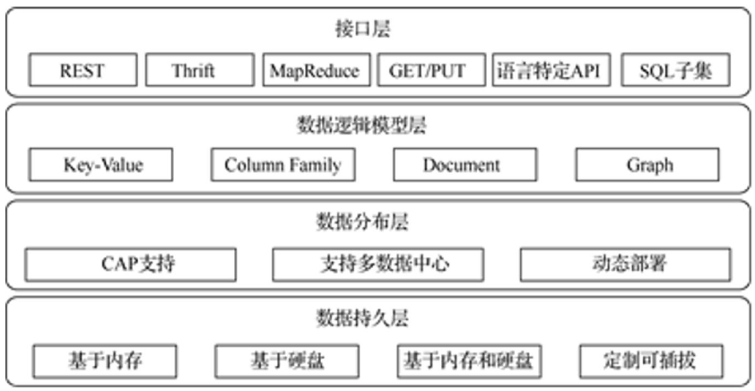
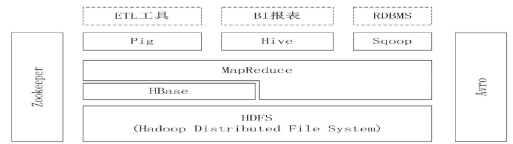
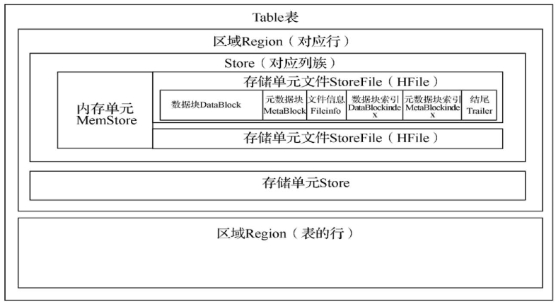
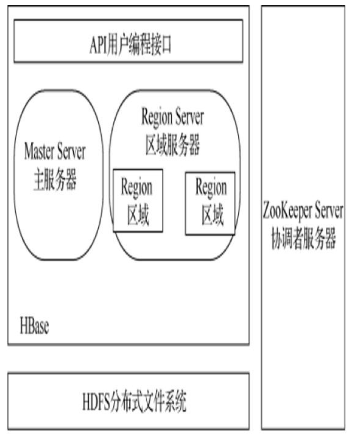
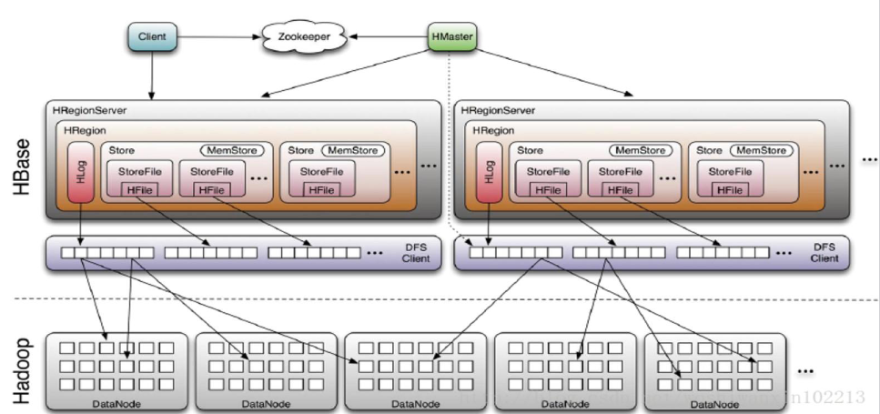
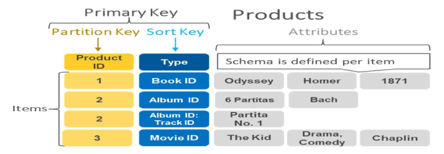
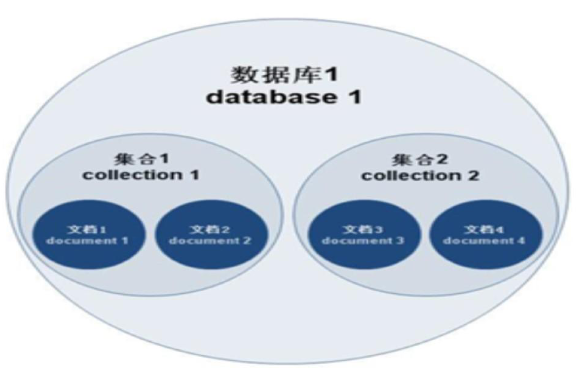
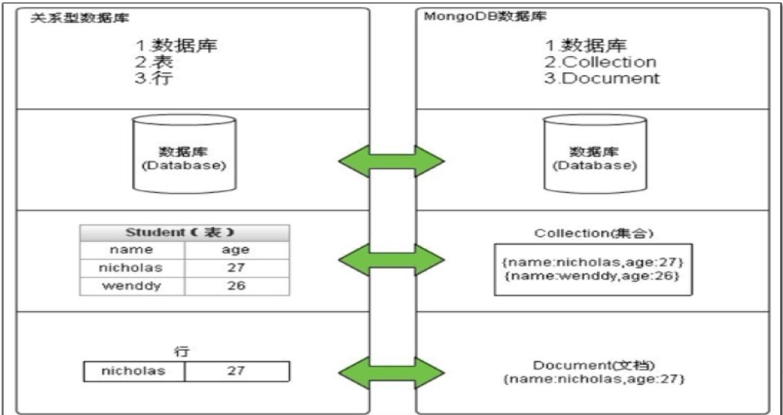
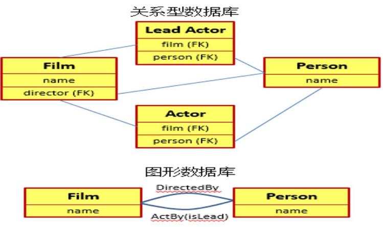

## 7.1 NoSQL数据库概述
### 一、关系数据库局限
- 不能直接管理非结构化数据
- 受单机服务器限制难以支持数据库高并发读写访问
- 受磁盘容量限制不能满足海量数据的高效存储和处理
- 实现分布式数据库的高扩展性、高可用性比较复杂
### 二、互联网时代数据处理需求
- 对各类数据（结构化、半结构化、非结构化数据）管理
- 大量用户同时访问应用要求数据库支持高并发读写访问
- 信息化社会每时每刻都产生大量数据需要数据库高效存储
- 信息服务系统连续运行要求数据库具有高扩展性和高可用性
### 三、大数据管理
#大数据 （big data），指无法在一定时间范围内用常规软件工具进行捕捉、管理和处理的数据集合。特点为：大量(Volume)、高速(Velocity)、多样(Variety)、真实(Varacity)和低价值(Value)。
1. 大数据处理挑战
	1. 数据类型多样性与异构性
	2. 海量数据存储访问高速性
	3. 数据处理的时效性
	4. 数据的安全与隐私保护
	5. 大数据的能耗问题
	6. 大数据管理易用性
2. 大数据存储
	- 大数据存储的关键技术包括分布式存储、数据一致性和可用性、负载均衡、容错机制、虚拟存储技术、云存储技术等。
	- 要求在分布式数据库的基础上，具有更高的数据访问速度；更强的可扩展性；更高的并发访问量。
	- 在可用性、一致性、高并发、高容量等方面达到平衡。
### 四、NoSQL数据库
1. NoSQL(Not only SQL Database)数据库是指一类非关系型、开源代码、具有水平扩展能力的分布式数据库。
	- 支持非结构化数据存储，不用预先定义模式
	- 分布式集群架构，无共享结构
	- 弹性可扩展，可动态增减数据库节点
	- 数据分区存储，各分区节点并发访问
	- 节点之间数据异步复制，实现最终数据一致性
	- 数据处理遵循BASE特性原则
2. BASE特性
	- Basically Available( #基本可用)，允许数据库系统某些部分出现故障，其余部分能够继续运行，一直提供服务。
	- Soft state( #软状态)，允许数据库系统存在暂时的数据不一致，经过纠错处理，系统数据最终保持一致态。
	- Eventual Consistency( #最终一致性)，系统数据在某个时刻达到最终一致性。
3. 数据库一致性
	- #强一致性 无论更新操作在哪个副本执行，数据复制是同步的，之后所有数据库节点都能获得最新的数据。
	- #弱一致性 数据更新在一个数据库节点执行，但数据复制是异步执行的，需要经过一定时间才能达到不同数据库节点数据一致。
	- #最终一致性 弱一致性的一种特例，保证用户最终能够读取到某操作对系统特定数据的更新。
4. 最终一致性的形式
	- #因果一致性 如果节点A在更新完某个数据后通知了节点B，那么节点B之后对该数据的访问和修改都是基于A更新后的值。与节点A无因果关系的节点C的数据访问则没有这样的限制。
	- #读一致性 当用户更新一个数据项后，它总是访问到更新过的值，但不保证其它用户都能读取到更新数据。
	- #会话一致性 将读取存储系统的进程限定一个会话范围内，只要会话存在，就可以保证读一致性。
	- #单调读一致性 如果一个节点从系统中读取出一个数据项的某个值后，那么系统对于该节点后续的任何数据访问都不应该返回更旧的值。
	- #单调写一致性 系统能够保证来自同一个节点的写操作被顺序地执行。
5. 典型NoSQL数据库比较

| 分类           | 典型数据库                      | 应用场景                                                     | 数据模型                                  | 优点                                                                   | 缺点                                                                         |
| -------------- | ------------------------------- | ------------------------------------------------------------ | ----------------------------------------- | ---------------------------------------------------------------------- | ---------------------------------------------------------------------------- |
| 键值存储数据库 | Redis，Voldemort，Oracle BDB    | 主要用于处理大量数据的高性能访问负载，也用于一些日志系统等。 | key-value键值对，通常采用hash table来实现 | 查找速度快                                                             | 数据无结构化，通常只被当作字符串或二进制数据                                 |
| 列存储数据库   | HBase，Cassandra，Riak          | 分布式联机事务处理系统                                       | 以列簇式存储，将同一列数据存在一起        | 查找速度快，可扩展性强，容易进行分布式扩展                             | 功能相对局限，不适合随机的更新                                               |
| 文档存储数据库 | MongoDB，CouchDB                | Web应用                                                      | Key-Value对应的键值对，Value为版本化文档  | 数据结构要求不严格，表结构可变，不需要像关系型数据库一样预先定义表结构 | 查询性能不高，而且缺乏统一的查询语法                                         |
| 图存储数据库   | Neo4J，InfoGrid，Infinite Graph | 社交网络，推荐系统等                                         | 图结构                                    | 利用图结构相关算法进行快速查找，比如最短路径寻址，N度关系查找等        | 需要对整个图做计算才能得出需要的信息，而且这种结构不容易实现分布式的集群方案 |
6. NoSQL数据库整体框架

	

7. NoSQL数据库优点
	- 可扩展性高
	- 分布式计算
	- 低成本
	- 架构灵活
	- 没有复杂的关系
8. NoSQL数据库缺点
	- 缺乏通用性
	- 不支持SQL查询功能
	- 不支持事务特性
	- 系统安全特性欠缺
9.  NoSQL数据库适合的应用场景
	- 解决传统关系型数据库无法解决的数据存储及访问问题
	- 解决大数据多样性、异构性、高速性等数据存储与处理问题
	- 解决互联网海量非结构化数据管理与应用问题
10. NoSQL数据库与关系型数据库比较
	- NoSQL数据库采用非结构化数据存储模型，关系数据库采用结构化数据存储模型
	- NoSQL数据库采用分布式部署，关系型数据库采用集中式部署
	- NoSQL数据库编程遵循BASE原则，关系型数据库编程遵循ACID事务原则
	- NoSQL数据库没有统一的数据操作标准，关系型数据库遵循SQL数据操作标准
	- NoSQL数据库支持海量数据存储，关系数据库数据存储受限于TB级别
### 五、分布式数据库
1. #分布式数据库 由位于不同地点的数据库服务器通过网络连接，组织管理一个逻辑上集中、物理上分布的大型数据库。
	- 分布式数据库优点
		- 具有灵活的体系结构
		- 适应分布式的管理和控制机构
		- 系统的可靠性高、可用性好
		- 局部应用的响应速度快
		- 可扩展性好，易于集成现有系统
	- 分布式数据库缺点
		- 系统通信开销大
		- 系统存取结构复杂
		- 数据安全性和保密性较难处理
	- 分布式数据库会出现数据不一致的情况：
		- 数据库节点故障
		- 通信网络出现故障
		- 两阶段提交过程中出现问题
2. 分布式数据库系统 #CAP 理论
	- 一致性（Consistency）：不同节点数据库保持一致
	- 可用性（Availablility）：数据访问请求随时可满足
	- 分区容忍性（Partition Tolerance）：当出现故障节点，系统仍能响应数据访问请求
3. CAP定理法则：一个分布式系统不可能同时满足一致性、可用性和分区容错性这三个基本需求，最多只能同时满足其中两项。
	1. 满足C和A
		- 满足C（一致性）需要所有服务器节点的数据都一样，这就要求数据在不同服务器节点进行复制同步。
		- 数据复制同步需要足够时间才能完成。节点越多，数据复制同步时间就越长。
		- 由于需要同时满足A，同步时间必须在足够短才行。因此，系统的服务器节点数就不能太多了，即P就难以满足了。
	2. 满足C和P
		- 满足P需要很多服务器，同时还需满足C，即需保证每台及其的数据都一样，那么数据同步的时间可能需要很长。
		- 在这种情况下，难以保证用户随时访问每台服务器获取到的数据都是最新的。想要获取最新数据，必须等全部服务器数据同步完成，但其等待时间早已超出A要求的时间。
	3. 满足A和P
		- 满足P需要有很多相同数据副本的服务器，同时还需满足A短时间内实现数据访问。难以解决不同服务器节点的数据一致性。
	4. CAP模型方案选择
		- CA：放弃分区容错性，保证一致性和可用性，即传统的单机数据库处理方式
		- AP：放弃强一致性，追求分区容错性和可用性，这是很多分布式系统设计时的选择。一些电商系统采用此方案。
		- CP：放弃可用性，追求一致性和分区容错性。很多NoSQL系统采用此方案。
## 7.2 列存储数据库原理
### 一、列存储模型
1. 列存储模型
	- 一种纵向切分数据的方式，不同列会放到不同的磁盘存储位置
	- 对于稀疏表（空值较多），其存储效率较高
	- 以列为单位进行数据读写
	- 在切片内一般会按行键进行排序，以加快分布式检索速度。
2. 列存储数据库与关系数据
	1. 关系数据库
		- 按行存储，每行数据存放在一个磁盘数据块
		- 需读取数据表所有的数据磁盘块，时间长
	2. 列存储数据库
		- 按列存储，每列数据放到一个数据块中
		- 只需读取数据表的指定数据磁盘块，时间短
### 二、HBASE数据库介绍

1. [HBase](https://hbase.apache.org/book.html)全称是Hadoop Database，是一个构建在Hadoop大数据平台上的列存储数据库。是一个开源的非关系型分布式数据库，用于存储海量非结构化与半结构化数据。Hbase建立在HDFS上，具有自动故障转移、自动分区、水平扩展等特性。
2. Hadoop生态系统

	

	- **Hadoop Common**：Hadoop体系最底层的一个模块，为Hadoop各子项目提供各种工具，如：配置文件和操作日志等。
	- **Avro**：用来做Hadoop的RPC，使Hadoop的RPC模块通信速度更快、数据结构更紧凑。
	- **HBase**：基于Hadoop Distributed File System，是一个开源的，基于列存储模型的分布式数据库。
	- **HDFS**：分布式文件系统。
	- **Hive**：Hive是基于Hadoop分布式计算平台上提供data warehouse的sql功能的一套软件。使得存储在Hadoop里面的海量数据汇总，即查询简单化。hive提供了一套QL的查询语言，以SQL为基础，使用方便。
	- **MapReduce**：实现了分布式计算编程框架。
	- **Pig**：是SQL-like语言，是在MapReduce上构建的一种高级查询语言，把一些运算编译进MapReduce模型的Map和Reduce中，并且用户可以定义自己的功能。
	- **ZooKeeper**：是一个针对大型分布式系统进行协调的软件组件，提供的功能包括：配置维护、名字服务、分布式同步、组服务等。ZooKeeper的目标就是封装好复杂易出错的关键服务，将简单易用的接口和性能高效、功能稳定的系统提供给用户。
### 三、HBASE数据库与关系数据库区别

|          | HBase                                                          | RDBMS                                            |
| -------- | -------------------------------------------------------------- | ------------------------------------------------ |
| 数据类型 | 只有字符串                                                     | 较丰富的数据类型                                 |
| 数据操作 | 简单操作，读（get）、写（put）、删除（delete）、扫描（scan）   | SQL语言各种操作                                  |
| 存储模式 | 基于列存储，每个列族都由几个文件保存，不同列族的文件是分离的。 | 基于关系表的行存储                               |
| 数据维护 | 更新操作并不会替换原来数据，而是生成一个新的版本数据。         | 更新操作最新的当前值去替换记录中原来的旧值。     |
| 可伸缩性 | 容易通过在集群中增加或者减少硬件节点数量来实现性能的伸缩。     | 较困难，需要使用中间件，并牺牲部分功能。         |
| 数据索引 | 只能通过行建索引，实现数据快速定位访问。                       | 可以针对不同列建立多个索引，以提高数据访问性能。 |
### 四、HBASE数据模型
1. 表：HBase采用表来组织数据，表由行和列组成，列划分为若干个列族。
2. 行：每个HBase表都由若干行组成，每个行由行键（row key）来标识。
3. 列族：一个HBase表被分组成许多列族（Column Family）的集合，它是基本的访问控制单元。
4. 列限定符：列族里的数据通过列限定符（或列）来定位
5. 单元格：在HBase表中，通过行、列族和列限定符确定一个单元格（cell），单元格中存储的数据没有数据类型，总被是为字节数组`byte[]`。
6. 时间戳：每个单元格都保存着同一份数据的多个版本，这些版本采用时间戳进行索引。

### 五、HBASE表物理存储

- Table所有行都按照row key的字典序排列。
- Table在行的方向上分割为多个 #区域 （ #Region ）。
- Region按大小分割，每个表开始只有一个region，随着数据增多，region不断增大，当增大到一个阈值时，region就会等分为两个新的region，之后会有越来越多的region。
- region是Hbase中分布式存储和负载均衡的最小单元，不同region分布到不同regionServer上。
- Region由一个或多个 #存储单元 #Store 组成，每个store保存一个列族columns family。每个store又由一个内存单元memStore和0至多个（[0, n]）个StoreFile组成。StoreFile以HFile格式保存在HDFS上。

- [Hfile格式](https://hbase.org.cn/docs/237.html)

- HBASE表物理存储结构

### 六、HBASE系统组成

1. Hbase数据库系统由主服务器（Master）、区域服务器（Region Server）、协调者服务器（ZooKeeper）构成一个分布式数据库服务器集群。在架构层面上，一般有1个Master和多个Region Server。Hbase是一个分布式的数据库，使用ZooKeeper来管理服务器集群。Hbase需要运行在HDFS之上，由HDFS提供基础的文件存储。Hbase提供外部访问数据的API，实现对数据库操作访问。

	

2. 主服务器（Master）
	- 监控管理区域服务器
	- 处理区域服务器故障转移
	- 管理数据库元数据
	- 负责分配Region给区域服务器
	- 进行数据均衡分布
	- 通过ZooKeeper发布自己的位置给客户端
3. 区域服务器（Region Server）
	- 处理客户端读写访问请求，直接为用户提供数据服务
	- 负责维护区域的合并与分割
	- 负责刷新缓存到HDFS文件
	- 维护HLog数据
4. 协调者（ZooKeeper）
	- 实现分布式集群系统的并发控制
	- 通过选举集群的master服务器
	- 负责Region和区域服务器的注册
	- 解决分布式环境下数据一致性、有序性、持久性，配置数据同步
5. 客户端（Client）
	- 通过API向Hbase发起访问请求
	- 与Master进行通信进行管理类操作
	- 与Region Server进行数据读写类操作

### 七、HBASE的系统架构

### 八、HBASE数据库的应用场景
- 对象存储：用来存储头条类、新闻类的新闻、网页、图片等应用数据，包括存储病毒公司的病毒库等。
- 推荐画像：用户的画像是比较大的稀疏矩阵，适合用HBase表来进行存储。
- 时空数据：如轨迹、气象网格之类数据，滴滴打车的轨迹数据，大数据量的车联网企业等数据都存在HBase中。
- 消息/订单：在电信领域、银行领域，很多订单查询底层的存储，这些通信、消息同步的应用构建在HBase之上。
## 7.3 键值对数据库原理
1. #键值数据库 （Key-Value Database）是一种按照键值数据表结构组织存储数据的内存数据库。

	

2. 键值数据库的数据模型
	- 数据结构：键值模型（Key-Value模型），每行记录由键和值两个部分组成，值可以是各种类型的数据
	- 数据操作：`Get(key), Set(key, value), Delete(key)`等
	- 数据完整性：针对单个键的操作才区别一致性
3. 键值数据库优缺点
	- 主要是在内存进行读写，其数据访问速度快
	- 数据结构简单，容易实现高效计算
	- 支持分布式处理，具备大数据处理能力
	- 对多值查找功能弱，难以处理关联查询
	- 缺少强制的数据约束，需应用程序进行处理
4. #Redis （Remote Dictionary Server）是一种基于内存组织、存储与管理数据的开源键值数据库。
	- Redis支持数据的持久化，可以将内存中的数据保存在磁盘中，重启的时候可以再次加载进行使用。
	- Redis不仅仅支持简单的key-value数据结构，同时还提供list、set、hash等数据结构。
	- Redis支持数据的备份，即master-slave模式的数据备份。
5. Redis数据库支持的数据类型
	- 字符串，最长为512MB
	- 哈希表，最多$2^{32}-1$个键值对
	- 链表，支持双向遍历
	- 无序集合，去重的元素集合，最多$2^{32}-1$个元素
	- 有序集合，去重的元素集合，最多$2^{32}-1$个元素
6. Redis数据库技术特点
	- Redis将键值存储在主存中，快速读写
	- Redis支持主从复制，数据读在从节点（slave）数据库中完成，数据写入在主节点（master）数据库中完成
	- Redis使用RAM作为内存式存储，用磁盘保存数据
	- Redis支持创建发布和订阅通道
	- Redis将内存中的数据定期保存到文件系统中，用于故障恢复
	- Redis有丰富的SDK支持，所有Redis操作都是原子的
7. 内存数据库与磁盘数据库比较
	1. 磁盘数据库典型代表：MySQL、MSSQL
		- 机制成熟可靠；
		- 提供强大的数据定义语言及数据操作语言，提供SQL支持；
		- 提供一定的主动机制（如触发器）和后台数据处理能力（如存储过程）
		- 占用、消耗的系统资源较多；
		- 数据存取的速度慢；
		- 数据存取时间不一致且难以预测。
	2. 内存数据库典型代表：Redis、Memcached
		- 存取速度快速、一致，消除I/O瓶颈
		- 存取时间易于预测
		- 易于定制数据存取方式
		- 对系统的故障恢复要求高
		- 通用性不强，对数据库的访问要求及访问方式不同
## 7.4 文档型数据库原理
1. #文档 是组织与处理信息的基本单位。 #文档数据库 区别于传统的其它数据库，它是用来管理文档的。
	- 存储方式：没有表结构或表结构可变
	- 可以进行复杂的查询条件
	- 文档其实是一个数据记录，能够对包含的数据类型和内容进行“自我描述”
	- 文档数据是用于存储、检索和管理面向文档和半结构化的数据。文档包括XML、YAML、JSON和BSON，还有二进制格式（诸如PDF和MS office文档）。
2. #MongoDB 是一种开源的分布式文档存储数据库系统。

	

3. 关系数据库与MongoDB对比

	

4. MongoDB数据存储
	1. JSON格式数据存储：JSON数据格式与语言无关，脱胎于JavaScript，但目前编程语言都支持JSON格式数据的生成和解析。
	2. BSON格式数据存储：BSON是MongoDB的数据存储格式。BSON基于JSON格式，选择JSON进行改造的原因主要是JSON的通用性及JSON的schemaless特性。
		- `db.meeting.insert({meeting:"M1 June",Date:"2018-01-06"});`
5. MongoDB数据库特点
	- JSON文档模型
	- 动态的数据模式
	- 二级索引强大
	- 查询功能
	- 自动分片
	- 水平扩展
	- 自动复制
	- 文本搜索
	- 企业级安全
	- 聚合框架MapReduce
	- 大文件存储GridFS

## 7.5 图形数据库原理

1. #图形数据库 是一种应用图形理论存储实体之间关系信息的NoSQL数据库，它是以图这种数据结构存储和查询数据的。
2. 图数据模型：实现图的数据结构有两种方式：[[5.1.1 图的基本概念#^d9472c|领接表]]、领接矩阵。
3. 关系数据库与图形数据库比较

	

4. #Neo4J 是一个有商业支持的开源图形数据库，它用高效的图形数据结构代替传统的表设计。它具备完整的ACID支持、高可用性、能够轻易扩展到上亿级别的节点和关系、能够通过遍历工具高速检索数据。
5. Neo4J数据模型：实体、关系、标签（Lable）、属性和遍历等。
6. Neo4J特点
	- 因其嵌入式、高性能、轻量级等优势，越来越受到关注。
	- 图形数据结构，在一个图中包含两种基本的数据类型：Nodes（节点）和Relatoinships（关系）。
	- Nodes和Relatoinships包含key-value形式的属性。
	- Nodes通过Relatoinships所定义的关系相连起来，形成关系型网络结构。